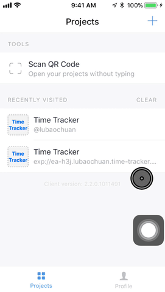
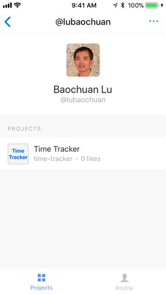

# Time Tracker App

# Users
## Export via Email
1. Tap on the "Export" button on the records screen or the report screen. You will see a new screen with the reports in the comma delimited format (CSV).
1. Tap on the "Email Me" button. A new email message will be opend in your default email app. The body of the message will be the report.
1. Enter an email address and hit send.



## Export via Copy & Paste
1. Tap on the "Export" button on the records screen or the report screen. You will see a new screen with the reports in the comma delimited format (CSV).
1. Press and hold on the text and select "copy" in the pop up menu. Now the text/report is in your clipboard.
2. You can paste the text into another app of your choice.



## Delete Records
The settings screen gives you options to delete all students, all subjects, and all learning records. You must type some text to confirm the deletion. This allows you purge the data in your app after you have exported the reports and no longer need the records.


# Developers
## Install packages:
```
npm install redux react-redux --save
npm install redux-logger --save
npm install redux-form --save
npm install redux-persist --save
npm install native-base --save
npm install prop-types --save
npm install react-navigation --save
npm install react-navigation-props-mapper --save
npm install react-native-datepicker --save
npm install moment --save
npm install react-native-mail --save
npm install react-native-communications --save
```
