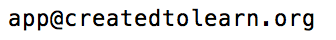

# Time Tracker App
An app for tracking and reporting learning time.

## Tools
* [Expo](https://expo.io/) for toolchain
* [react-native](https://facebook.github.io/react-native/) for structure
* [native-base](https://nativebase.io/) for UI components
* [react-redux](https://redux.js.org/) for state management
## Installed Packages
```
npm install redux react-redux --save
npm install redux-logger --save
npm install redux-form --save
npm install redux-persist --save
npm install native-base --save
npm install prop-types --save
npm install react-navigation --save
npm install react-navigation-props-mapper --save
npm install react-native-datepicker --save
npm install moment --save
npm install react-native-communications --save
```

# Support
You can view user instructions at http://www.createdtolearn.org/support/

Please send issue reports and feature requests to


